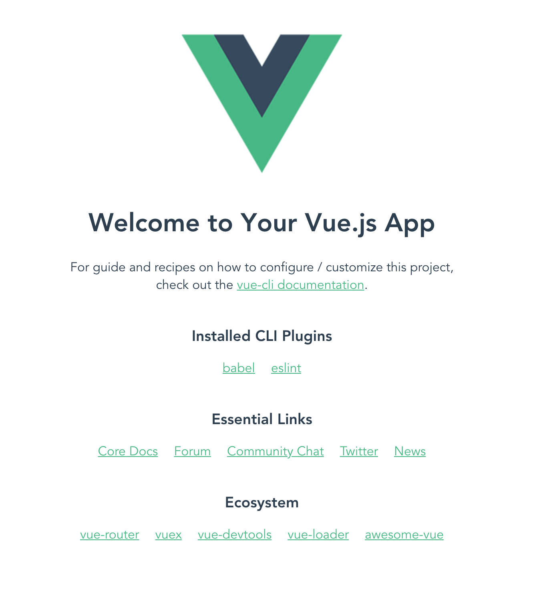

# 1. Vue.js로 웹개발 시작하기

## 개발환경 설정

### 1. node.js 설치하기

<a href="https://nodejs.org/ko/">https://nodejs.org/ko/</a>

### 2. vue/cli 설치하기

```bash
npm install -g @vue/cli
```

```bash
# 버전 확인
vue --version
# or
vue -V
```

### 3. 텍스트에디터 설치하기

추천 에디터

1. WebStorm - 유료
2. vscode - 무료

### 4. vue cli로 프로젝트 생성

```bash
vue create 프로젝트이름
```

프로젝트 생성시 여러가지 옵션들을 선택하게되는데,
여기에 대해 잘 모른다면,
두번째 선택지에서 Use NPM을 선택하시고 나머지는 기본을 선택하시면 됩니다.
3.0.4 기준으로는 선택지가 한개밖에없네요. 그냥 선택하고 넘어가시면 됩니다.

### 5. 에디터에서 생성한 프로젝트열기

```
에디터에서 생성한 프로젝트의 디렉토리를 추가하거나 open 하면됩니다.
```

### 6. 로컬에서 웹 띄우기

```bash
npm run serve
```

### 7. 브라우저에서 생성한 프로젝트 확인하기

```bash
http://127.0.0.1:8080/
# or
http://localhost:8080/
```

빈페이지가 아닌, 아래와 같은 화면이 나오면 성공

