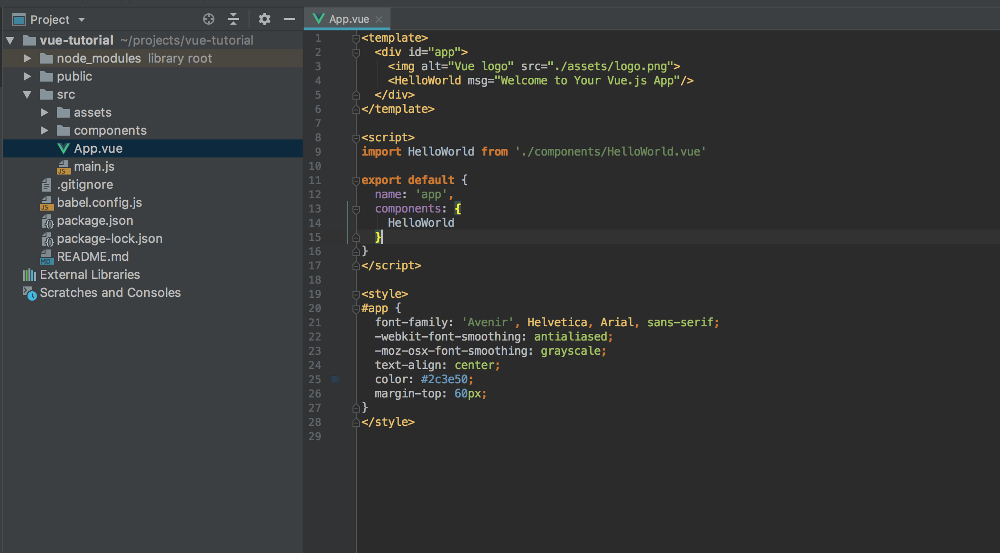
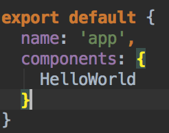

# 2. 컴포넌트 기본

저번에 vue cli를 활용해서 vue 프로젝트를 간단하게 생성했습니다.

아래 그림은 생성한 프로젝트의 src/App.vue를 열어본 모습입니다.



코드를 보시면, 상단에 template내에 html태그'처럼' 생긴것들이 눈에 보입니다.

그리고 HelloWorld 태그를 보시죠.

html태그에서는 볼수 없던 태그이죠?

이름만 봐도 누군가 커스텀으로 만든것처럼 보입니다.



위 그림을 보시죠

저런식으로 export default로 내보낸 vue 객체내에,

components 객체에 변수를 바인딩하게되면,

템플릿에서 사용가능한 컴포넌트가 됩니다.

HelloWorld는 컴포넌트라는 것이죠.

```js
import HelloWorld from './components/HelloWorld.vue'
```

스크립트의 첫줄을 보시면 위의 코드를 보실 수 있는데요,

HelloWorld 컴포넌트는 components 디렉토리에 존재하는걸 알 수 있습니다.

그렇다면 컴포넌트라는게 무엇일까요.

이해하기쉽게 <b>'html 엘리먼트의 집합체'</b>라고도 표현할 수 있겠습니다.

정확하게는 vue 객체라고 표현하는게 올바릅니다.

html 엘리먼트가 없는 컴포넌트도 있거든요.

vue 컴포넌트에는 다양한 옵션(기능)들이 존재합니다.

최종적으로 vue의 여러가지 컴포넌트들을 조합해서 하나의 웹사이트가 구성됩니다.

그리고 싱글파일컴포넌트(SFC)라는 용어가 있는데요,

HelloWorld.vue 처럼, 확장자를 vue로 가지면서,

export default하는 객체가 있다면, 그것을 싱글파일컴포넌트라고 부릅니다.

(파일하나에 여러개의 vue 컴포넌트를 생성할 수 있습니다.)